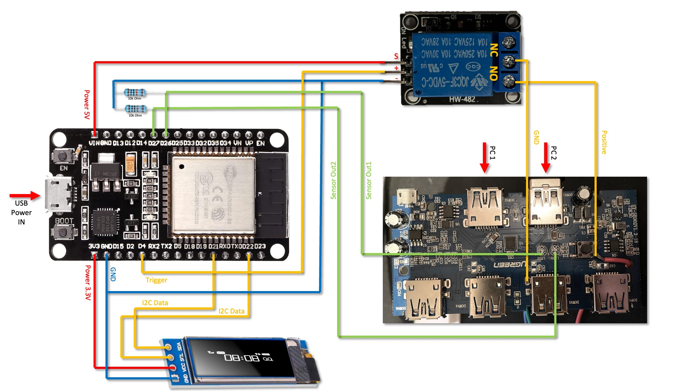

# MQTT_USB_Switcher

## Introduction

Retrofitting an old ugreen usb switcher to be controlled via MQTT and Home Assistant and then Home Kit.  
To achieve that, I used and ESP32 Board and one relais. 

### Parts
- ESP32 Microcontoller ([Link](https://amzn.eu/d/09rRW8V)
- Arduino Relais ([Link](https://www.amazon.de/dp/B07BVXT1ZK?ref=ppx_pop_mob_ap_share))
- UGREEN USB 3.0 Switcher ([Link](https://www.amazon.de/dp/B01N6GD9JO?ref=ppx_pop_mob_ap_share))
- 0,91" OLED Display ([Link](https://amzn.eu/d/3ufx9ke))
- Wires
- 2x 10k Ohm Resistor

### Software needed
- HomeAssistant  ([Link](https://www.home-assistant.io/))
- MQTT Brooker Add-On ([Link](https://mosquitto.org/))

---

## Setup

### Communication

MQTT

### Display

For information purposes I installed an 128x32px OLED display. It shows following informations:
- WLAN SSID
- WLAN Strenght in %
- IP Address
- Current selected USB Out

### PINs

#### Output
➡ **PIN 2:** Status LED wich ouput is selected.  
➡ **PIN 4:** Controlls the relais.  

#### Input
⬅ **PIN 26:** Output 1 is selected  
⬅ **PIN 27:** Output 2 is selected  

#### Reserved
❌ **PIN 21:** Used for OLED connection (I2C SDA)  
❌ **PIN 22:** Used for OLED connection (I2C SCL)

---

## How does it work ? 

The ESP32 controlls the Relais everytime it gets a command from HomeAssistant.  
For every command it pulses for one second, so the Input on the UGREEN USB Switch changes. 

On the setup I Always set the state. So in HomeKit "On" is Always Output 1 and "Off" is always Output 2

---

## Wiring diagram

---
